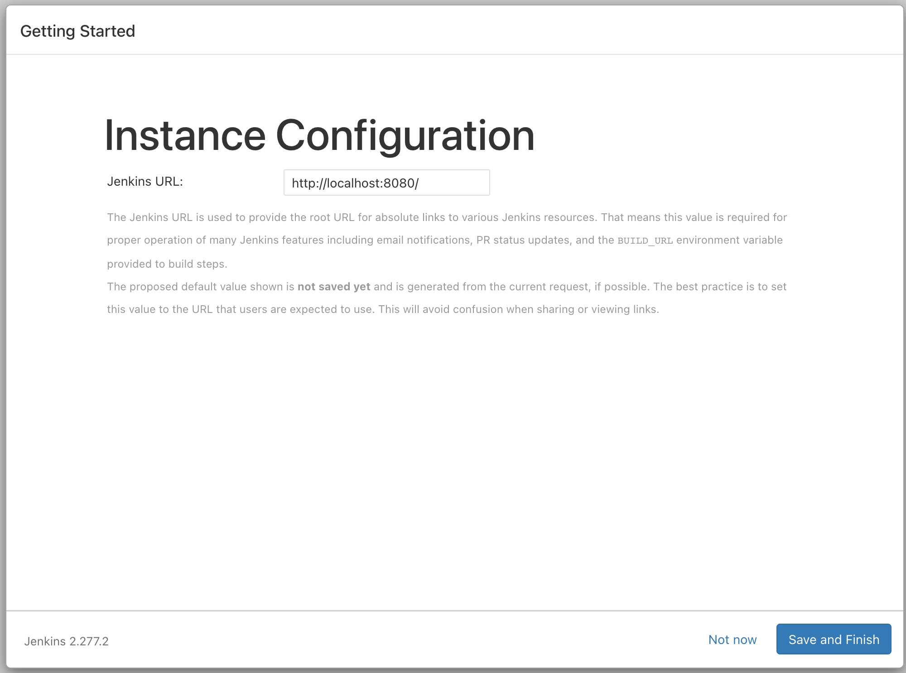

# Jenkins

[Jenkins 官網](https://www.jenkins.io/)

## 在本機環境執行

先至 https://hub.docker.com/r/jenkins/jenkins 參考最新教學

執行指令將 Jenkins Server 執行起來

```bash
docker run -d -v jenkins_home:/var/jenkins_home -p 8080:8080 -p 50000:50000 --name jenkins jenkins/jenkins:lts
```

開啟 http://localhost:8080，會看到如下畫面


會發現它需要輸入密碼來解鎖，這密碼可以從 Log 獲得


接下來會進入安裝畫面，這部分就看個人需求，可以先依照建議做安裝


安裝完後會進入建立 Admin User 的環節





